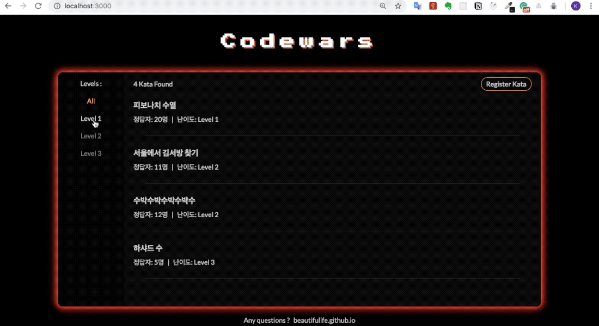

# Vanilla-Code-Wars

등록되어 있는 알고리즘 문제를 풀 수 있는 어플리케이션을 만드는 과제



### Setup

```sh
npm install
```
  
## Development

```sh
npm run dev
```

## Features

- node.js, express를 통해 서버 라우팅으로 구현
- 각 레벨별 해당하는 문제만 정렬
- mongoDB를 활용해 문제 저장
- 사용자가 제출한 문제풀이를 서버에서 실행
- 정답여부 Database에 저장
- 새로운 문제 등록
- 정답여부 별 결과 페이지 분리
- 서버에 대한 에러처리

## Resources

* [NodeJS](https://nodejs.org/api/)
* [Express](https://expressjs.com/)
* [Mongoose](http://mongoosejs.com/)
* [mlab](https://mlab.com)
